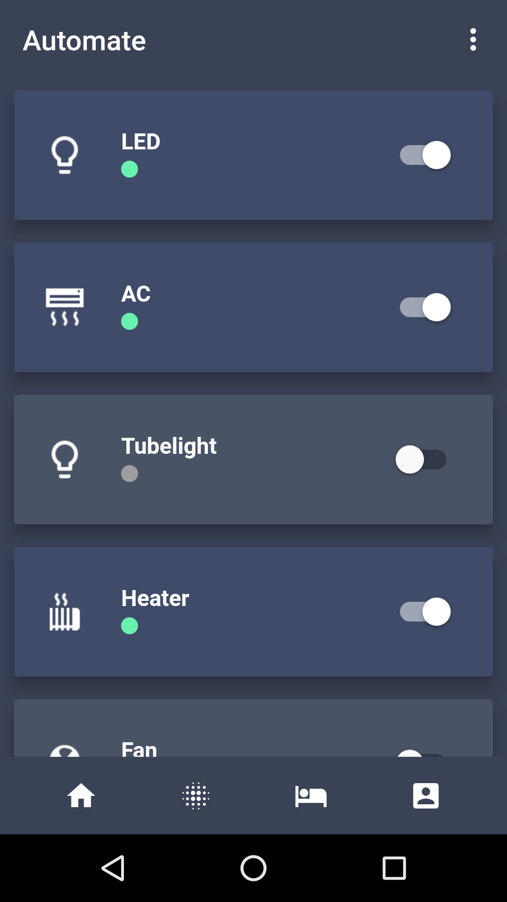
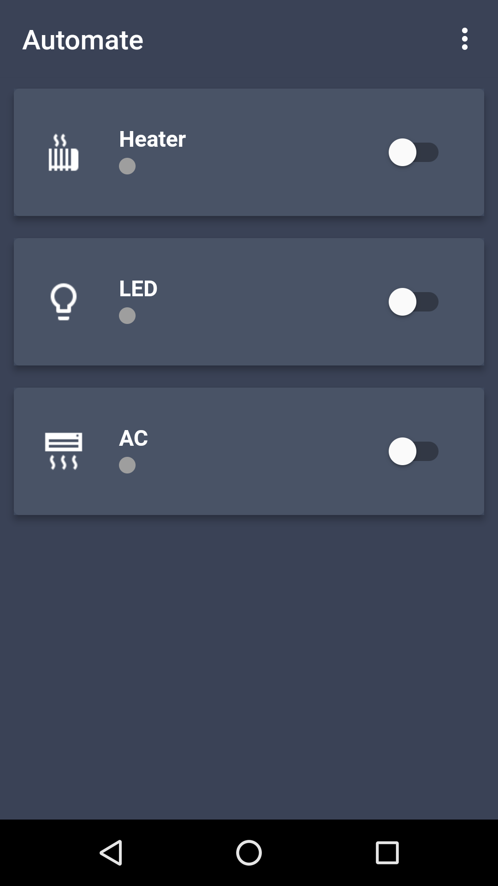
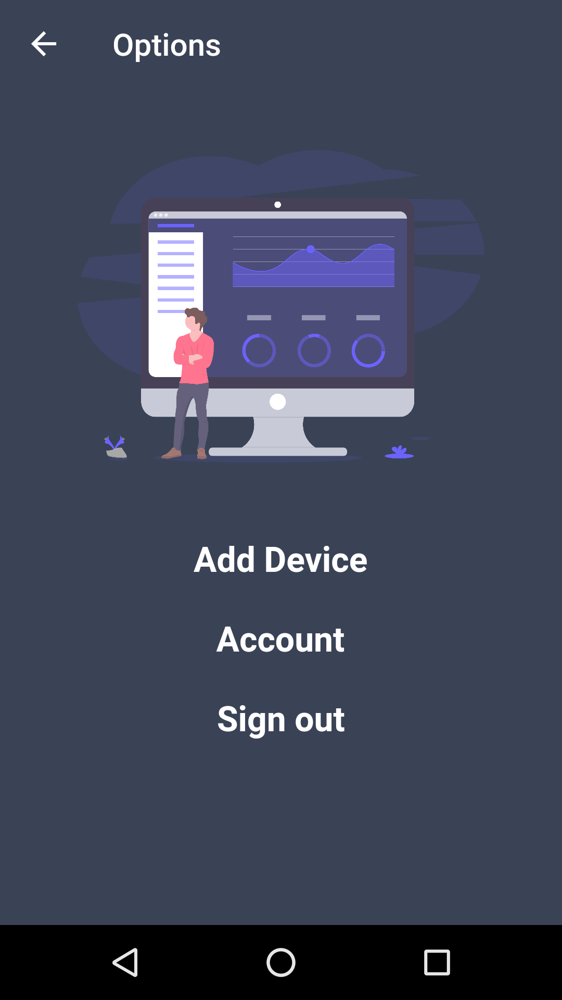

# Automate

This repository contains the code for the flutter client for automate which is a home automation project.

## Tech used in automate

1. Firebase realtime db
2. Cloud functions to update device status for an authenticated user
3. Node-red on a raspberry pi connected to node-mcu to turn on/off devices
4. Flutter client to change device status in the firebase database
5. Angular web app to change device status in the firebase database

  
  
  

